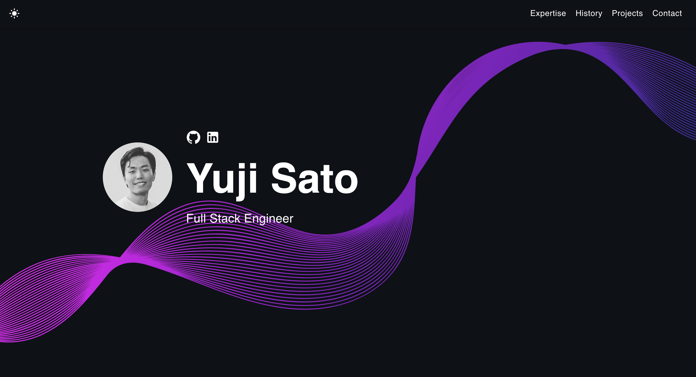

# Michael Yi Template 🚀

      

## What is this?

This simple portfolio template is designed to showcase your past projects, career history, skill sets, and more.

View the [Demo](https://yujisatojr.github.io/react-portfolio-template/).

## Features

✅ Open source (free to use, no attribution required)  
✅ Responsive design & mobile-friendly  
✅ Supports both dark and light modes  
✅ Highly customizable multi-component layout  
✅ Built with modern technologies (React, TypeScript, JavaScript, and SCSS)  

